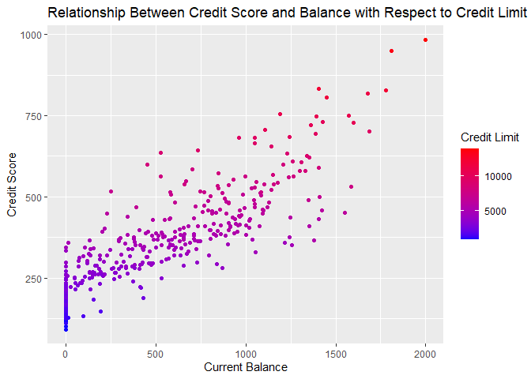
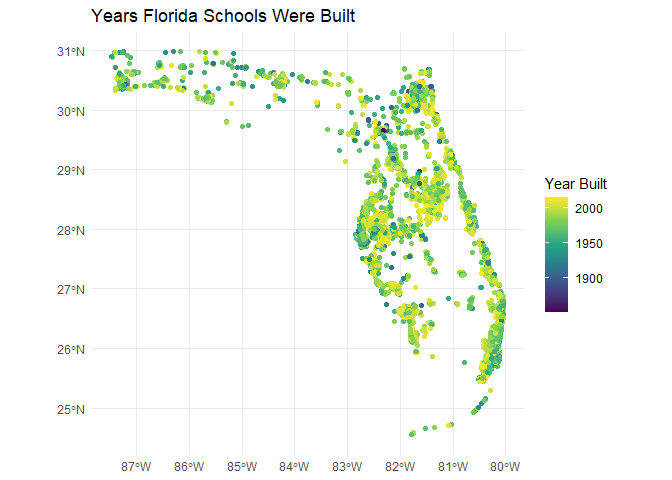
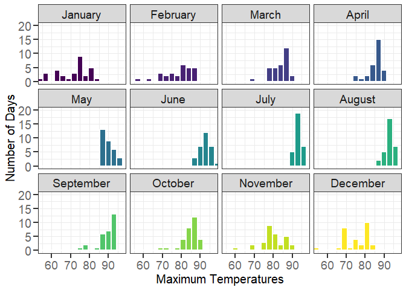

# Data Visualization and Reproducible Research

> Katherine Amato. 

The following is a sample of products created during the _"Data Visualization and Reproducible Research"_ course.

## Project 01

In this project I analyzed the data **Credit.csv**. I created both scatter plots and bar charts exploring possible correlations in plots like *credit limit vs income*, *credit score vs current balance*, etc. These two specific example I gave showed linear trends. I also explored if there was any correlation between gender or ethnicity and there was absolutely none. You can find code and report in the `project_01/` folder.

**Sample data visualization:** 

<!-- -->

#### Added Revisions
- Added another variable to be explored in the first plot by coloring by rating
- Added another variable to be explored in the second plot by filing by student status
- Altered graph aesthetics to enhance visualization of the graphs and data, made it look cleaner and nicer. The size and look of the graph text, titles, legends, etc were improved.

## Project 02
In this project, I explored how to create three types of graphs/visualizations: an *interactive plot*, a *spatial visualization*, and a *visualization of a model*. For the interactive plot and the visualization of a model plot, the data set **ToyotaCorolla.csv** was used. The interactive graph showed the Price vs Current Mileage on various Toyota Corolla vehicles. The graph points were colored by fuel type and sized by horsepower of the vehicle. Then data such as *model*, *year*, *color*, and *number of cylinders* was shown as part of the interactive data shown when hovering over the various points. In the visualization of a model graph, Price vs Current Mileage was analyzed again but this time using a linear method. A coefficients plot was then developed to show how various variable affect the variable of price. Here the variable *manufacturing year* showed to have the most effect on the variable *price* rather than *horsepower* or *current mileage*. The data set *Public_Private_Schools_in_Florida-2017.csv* was used for creating the spatial visualization plot. In this plot all the various schools in Florida were graphed within the shape of Florida. It made visualizing the data so much clearer since you could see it right on the state itself. You can find the code and report in the `project_02/` folder.

#### Added Revisions
- Altered graph aesthetics to enhance visualization of the graphs and data, made it look cleaner. The size and look of the graph text, titles, legends, etc were improved.
- Added another two plots after the coefficients plot to enforce the trends shown and discovered in the coefficients plot. I plotted a scatter plot of price vs horsepower and price vs manufacturing year to further prove the accuracy of the trend shown within the coefficients plot.

**Sample data visualization:** 

<!-- -->

## Project 03
In this project, I explored various types of graphs and plots and a variety of aesthetics and text alterations. I learned how to really analyze a graph, recognizing all the details, experimenting/testing with how to replicate the overall look of the graph reference. The first data visualization showed the number of days of each maximum temperature in the respective months. This graph used the **lubridate** package so that functions such as *ymd()* could be used to alter the data table. The second and third plot showed a density vs maximum temperature line graph, with the third plot showing the line graph for each respective month individually. Both graphs used the *geom_density function* with the second graph using the *kernel parameter*. The fourth graph shows a line graph of the maximum temperatures in each month and displaying the median quantile line. This graph used the **ggridges** package so that the *geom_density_ridges()* function could be used. The fifth plot shows the total precipitation for each month, displaying the average max temperature for each month as well. Finally the last graph shows twelve songs and the corresponding most spoken words in the song. This graph used the **tidytext** package and *unnest_tokens()* function. You can find the code and report in the `project_03/` folder.

**Sample data visualization:** 

<!-- -->

### Moving Forward
I learned the basics of how to create data visualizations as well as some spefic complex aspects of it and what you can do. I definetly plan to keep exploring data thats about the world around us as the trends discovered there could be ones that affect my day to day life. Discovering those can help make my life potentially easier or maybe others if I share what I might find. Even though this course is not related to my degree and is not something I will be pursuing, I have gathered knowledge and learned lots of the basics and some complexities of how to create data visualizations and tell or show a story with them. Just like Ben Wellington I think I have found some fun within experimenting with this data visualization and I definetly might start doing it as a hobby on the side. Its fun to experiment with and the trend you can discover can be more important than you realize just as Ben had come to find out. He discovered many flaws in the systems around him and actually tried to make a change. I hope that I could either maybe do the same or learn from the trends I discover find a way to make my life or the world better.